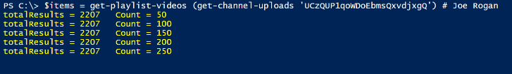
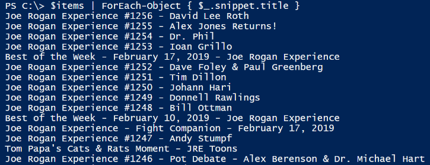
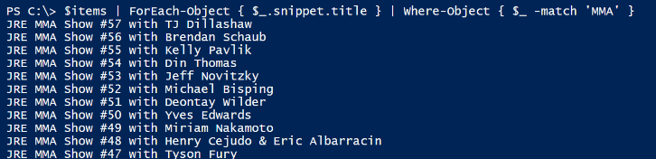

**Getting a list of YouTube channel titles**


Given these two functions:

We can get the list of videos for the Joe Rogan channel:

```powershell
$items = get-playlist-videos (get-channel-uploads 'UCzQUP1qoWDoEbmsQxvdjxgQ') # Joe Rogan
```


The retrieval progress will be shown:



Now we can list the titles of the videos:

```powershell
$items | ForEach-Object { $_.snippet.title }
```




Show titles which contain certain text:

```powershell
$items | ForEach-Object { $_.snippet.title } | Where-Object { $_ -match 'MMA' }
```


